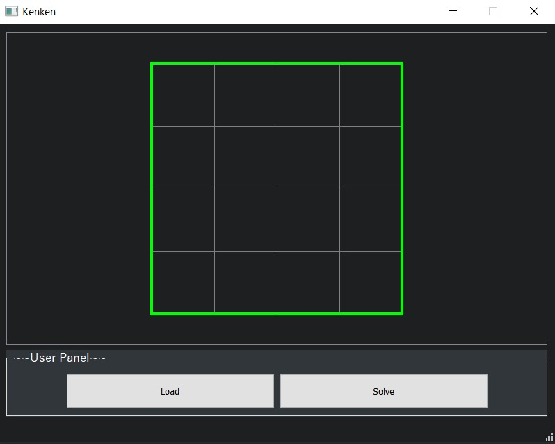
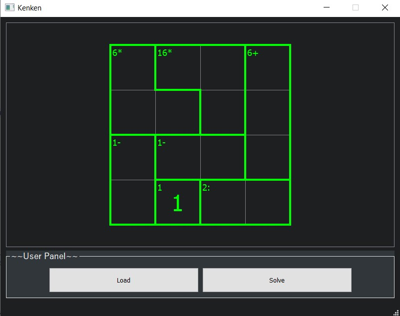
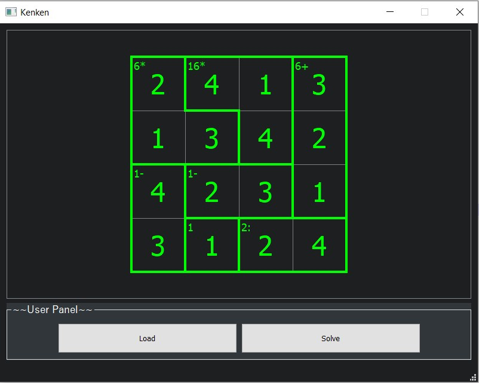

# Kenken - Solver
***

Appearance
=====================

**Screenshot 1 - Main Window without map**
 
 

**Screenshot 1 - Main Window after loading the map**
 
 

**Screenshot 1 - Main Window after solving the map**
 
 

Load:
=====================
1. Click on button *Load*.	
2. Choise map *(examples of maps in the tests/data)*.

Solve:
=====================
1. Click on button *Solve*.
2. Wait (for map 3x3 ~0 ms, 4x4 ~15 - 50 ms, 5x5 >14000 ms).
		